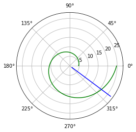
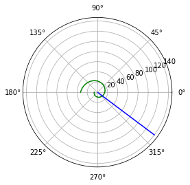

---
## Front matter
lang: ru-RU
title: Лабораторная работа №2
author: |
	Artur A. Davtyan\inst{1}
institute: |
	\inst{1}RUDN University, Moscow, Russian Federation
date: RUDN University, 13 February, 2021 Moscow, Russia

## Formatting
toc: false
slide_level: 2
theme: metropolis
header-includes: 
 - \metroset{progressbar=frametitle,sectionpage=progressbar,numbering=fraction}
 - '\makeatletter'
 - '\beamer@ignorenonframefalse'
 - '\makeatother'
aspectratio: 43
section-titles: true
---

# Прагматика выполнения лабораторной работы (Зачем)

## Прагматика выполнения лабораторной работы (Зачем)

- Изучение основ математического моделирования.

- Умение строить траектории движения в теории и визуализировать их.

# Цель выполнения лабораторной работы

## Цель выполнения лабораторной работы

- Научиться решать задачу о погоне;
- Строить графики траектории движения;
- Выводить уравнение, описывающее движение.

# Задачи выполнения лабораторной работы

## Задачи выполнения лабораторной работы

- Записать уравнение, описывающее движение катера, с начальными условиями для двух случаев (в зависимости от расположения катера относительно лодки в начальный момент времени).
- Постройте траекторию движения катера и лодки для двух случаев.
- Найдите точку пересечения траектории катера и лодки 

# Результаты выполнения лабораторной работы

## Уравнение

{ #fig:001 width=70% }

## Результаты выполнения лабораторной работы

{ #fig:002 width=70% }

## Результаты выполнения лабораторной работы

{ #fig:003 width=70% }

## Результаты выполнения лабораторной работы

\centering \Huge Хайп начался.

## {.standout}

Спасибо за внимание!
