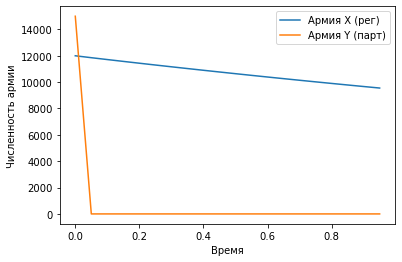

---
## Front matter
lang: ru-RU
title: Лабораторная работа №3
author: |
	Artur A. Davtyan\inst{1}
institute: |
	\inst{1}RUDN University, Moscow, Russian Federation
date: RUDN University, 26 February, 2021 Moscow, Russia

## Formatting
toc: false
slide_level: 2
theme: metropolis
header-includes: 
 - \metroset{progressbar=frametitle,sectionpage=progressbar,numbering=fraction}
 - '\makeatletter'
 - '\beamer@ignorenonframefalse'
 - '\makeatother'
aspectratio: 43
section-titles: true
---

# Прагматика выполнения лабораторной работы (Зачем)

## Прагматика выполнения лабораторной работы (Зачем)

- Модель Ланчестера и сейчас применяется в военном деле для расчета военных потерь.

- Она может использоваться во всех конфликтных ситуациях, заключающихся в противоборстве двух сторон: 
	- в юриспруденции (обвинение и защита);
	- учебный процесс (правильно и неправильно понятые фрагменты знаний);
	- в растениеводстве (борьба видов);
	- политологии (полемика сторон);
	- при конкуренции фирм путем использования рекламы на различные виды продукции. 

# Цель выполнения лабораторной работы

## Цель выполнения лабораторной работы

- Рассмотреть простейшую модель боевых действий – модель Ланчестера:
	- просчитывать возможности подходов подкреплений к армиям;
	- составлять системы дифференциальных уравнений изменения численностей армий;
	- строить графики для моделей боевых действий. 

# Задачи выполнения лабораторной работы

## Задачи выполнения лабораторной работы

- Построить графики изменения численности армии для двух случаев:
	- военные действия между двумя регулярными войсками;
	- военные действия между регулярным войском и партзанами. 

# Результаты выполнения лабораторной работы

## Результаты выполнения лабораторной работы

{ #fig:002 width=70% }

## Результаты выполнения лабораторной работы

{ #fig:003 width=70% }

## Результаты выполнения лабораторной работы

\centering \Huge Хайп начался.

## {.standout}

Спасибо за внимание!
