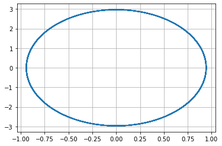
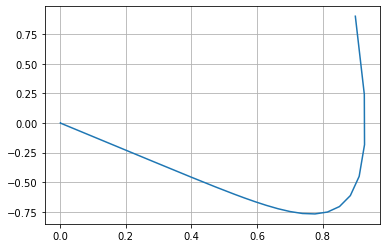
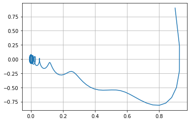

---
# Front matter
lang: ru-RU
title: "Лабораторная работа №4"
subtitle: "Модель гармонических колебаний"
author: "Давтян Артур Арменович"

# Formatting
toc-title: "Содержание"
toc: true # Table of contents
toc_depth: 2
lof: true # List of figures
lot: true # List of tables
fontsize: 12pt
linestretch: 1.5
papersize: a4paper
documentclass: scrreprt
polyglossia-lang: russian
polyglossia-otherlangs: english
mainfont: PT Serif
romanfont: PT Serif
sansfont: PT Sans
monofont: PT Mono
mainfontoptions: Ligatures=TeX
romanfontoptions: Ligatures=TeX
sansfontoptions: Ligatures=TeX,Scale=MatchLowercase
monofontoptions: Scale=MatchLowercase
indent: true
pdf-engine: lualatex
header-includes:
  - \linepenalty=10 # the penalty added to the badness of each line within a paragraph (no associated penalty node) Increasing the value makes tex try to have fewer lines in the paragraph.
  - \interlinepenalty=0 # value of the penalty (node) added after each line of a paragraph.
  - \hyphenpenalty=50 # the penalty for line breaking at an automatically inserted hyphen
  - \exhyphenpenalty=50 # the penalty for line breaking at an explicit hyphen
  - \binoppenalty=700 # the penalty for breaking a line at a binary operator
  - \relpenalty=500 # the penalty for breaking a line at a relation
  - \clubpenalty=150 # extra penalty for breaking after first line of a paragraph
  - \widowpenalty=150 # extra penalty for breaking before last line of a paragraph
  - \displaywidowpenalty=50 # extra penalty for breaking before last line before a display math
  - \brokenpenalty=100 # extra penalty for page breaking after a hyphenated line
  - \predisplaypenalty=10000 # penalty for breaking before a display
  - \postdisplaypenalty=0 # penalty for breaking after a display
  - \floatingpenalty = 20000 # penalty for splitting an insertion (can only be split footnote in standard LaTeX)
  - \raggedbottom # or \flushbottom
  - \usepackage{float} # keep figures where there are in the text
  - \floatplacement{figure}{H} # keep figures where there are in the text
---

# Цель работы

Остроить фазовый портрет гармонического осциллятора и решить уравнения гармонического осциллятора для следующих случаев
1. Колебания гармонического осциллятора без затуханий и без действий внешней силы $\ddot {x} + 9.9x = 0$
2. Колебания гармонического осциллятора c затуханием и без действий внешней силы $\ddot {x} + 9 \dot {x} + 9x = 0$
3. Колебания гармонического осциллятора c затуханием и под действием внешней силы $\ddot {x} + 9 \dot {x} + 9x = 0.9sin(9t)$

На интервале $t \in [0; 69]$(шаг 0.05) с начальными условиями $x_0 = 0.9, y_0 = 0.9$

# Выполнение лабораторной работы

## Теоретическое введение

   Уравнение свободных колебаний гармонического осциллятора имеет следующий вид:

$$ \ddot {x} + 2 \gamma \dot {x} + w_0^2x = f(t) $$

$x$ — переменная, описывающая состояние системы (смещение грузика, заряд
конденсатора и т.д.)

$t$ — время

$w$ — частота

$\gamma$ — затухание

   Обозначения:

$$ \ddot{x} = \frac{\partial^2 x}{\partial t^2}, \dot{x} = \frac{\partial x}{\partial t}$$


   При отсутствии потерь в системе получаем уравнение консервативного осциллятора, энергия колебания которого сохраняется во времени:

$$ \ddot {x} + w_0^2x = 0 $$


   Для однозначной разрешимости уравнения второго порядка необходимо задать два начальных условия вида:

$$ \begin{cases} x(t_0) = x_0 \\ \dot{x}(t_0) = y_0 \end{cases} $$

   Уравнение второго порядка можно представить в виде системы двух уравнений первого порядка:

$$ \begin{cases} \dot{x} = y \\ \dot{y} = -w_0^2x \end{cases} $$

   Начальные условия для системы примут вид:

$$ \begin{cases} x(t_0) = x_0 \\ y(t_0) = y_0 \end{cases} $$

   Независимые переменные x, y определяют пространство, в котором «движется» решение. Это фазовое пространство системы, поскольку оно двумерно будем называть его фазовой плоскостью.
   
   Значение фазовых координат x, y в любой момент времени полностью определяет состояние системы. Решению уравнения движения как функции времени отвечает гладкая кривая в фазовой плоскости. Она называется фазовой траекторией. Если множество различных решений (соответствующих различным начальным условиям) изобразить на одной фазовой плоскости, возникает общая картина поведения системы. Такую картину, образованную набором фазовых траекторий, называют фазовым портретом.

## Код на Python

```
import math
import numpy as np
from scipy.integrate import odeint
import matplotlib.pyplot as plt

# Первый случай

w = math.sqrt(9.9);
g = 0.00;

# Правая часть уравнения
def f(t):
    f = 0
    return f

#Вектор-функция f(t, x) для решения системы дифференциальных уравнений x' = y(t, x)
def y(x, t):
    dx1 = x[1]
    dx2 = - w*w*x[0] - 2*g*x[1] - f(t)
    return dx1, dx2

#Вектор начальных условий x(t0) = x0
x0 = np.array([0.9, 0.9])

#Интервал, на котором будет решаться задача
t = np.arange(0, 69, 0.05)

#Решаем дифференциальные уравнения с начальным условием x(t0) = x0 на интервале t с правой частью, заданной y и записываем решение в матрицу x
x = odeint(y, x0, t)

#Переписываем отдельно
y1 = x[:,0]
y2 = x[:,1]

plt.plot(y1,y2)
plt.grid(axis='both')


# Второй случай

w2 = math.sqrt(9);
g2 = 4.50;

#Правая часть уравнения
def f2(tt):
    f2 = 0
    return f2

#Вектор-функция f(t, x) для решения системы дифференциальных уравнений x' = y(t, x)
def y22(xx, tt):
    dxx1 = xx[1]
    dxx2 = - w2*w2*xx[0] - 2*g2*xx[1] - f2(tt)
    return dxx1, dxx2

#Вектор начальных условий x(t0) = x0
xx0 = np.array([0.9, 0.9])

#Интервал, на котором будет решаться задача
tt = np.arange(0, 69, 0.05)

#Решаем дифференциальные уравнения с начальным условием x(t0) = x0 на интервале t с правой частью, заданной y и записываем решение в матрицу x
xx = odeint(y22, xx0, tt)

#Переписываем отдельно
yy1 = xx[:,0]
yy2 = xx[:,1]

plt.plot(yy1,yy2)
plt.grid(axis='both')


# Третий случай

w3 = math.sqrt(9);
g3 = 4.50;

#Правая часть уравнения
def f3(ttt):
    f3 = 0.9*np.sin(9*ttt)
    return f3

#Вектор-функция f(t, x) для решения системы дифференциальных уравнений x' = y(t, x)
def y33(xxx, ttt):
    dxxx1 = xxx[1]
    dxxx2 = - w3*w3*xxx[0] - 2*g3*xxx[1] - f3(ttt)
    return dxxx1, dxxx2

#Вектор начальных условий x(t0) = x0
xxx0 = np.array([0.9, 0.9])

#Интервал, на котором будет решаться задача
ttt = np.arange(0, 69, 0.05)

#Решаем дифференциальные уравнения с начальным условием x(t0) = x0 на интервале t с правой частью, заданной y и записываем решение в матрицу x
xxx = odeint(y33, xxx0, ttt)

#Переписываем отдельно
yyy1 = xxx[:,0]
yyy2 = xxx[:,1]

plt.plot(yyy1,yyy2)
plt.grid(axis='both')
```
## Графики

График первого случая. Колебания гармонического осциллятора без затуханий и без действий внешней силы $\ddot {x} + 9.9x = 0$ (рис. -@fig:001)

{ #fig:001 width=70% }

График второго случая. Колебания гармонического осциллятора c затуханием и без действий внешней силы $\ddot {x} + 9 \dot {x} + 9x = 0$ (рис. -@fig:002)

{ #fig:002 width=70% }

График третьего случая. Колебания гармонического осциллятора c затуханием и под действием внешней силы $\ddot {x} + 9 \dot {x} + 9x = 0.9sin(9t)$ (рис. -@fig:003)

{ #fig:003 width=70% }

## Ответы на вопросы

### Запишите простейшую модель гармонических колебаний
Простейшим видом колебательного процесса являются простые гармонические колебания, которые описываются уравнением $x = x_m cos (ωt + φ0)$. 
    

### Дайте определение осциллятора
Осциллятор — система, совершающая колебания, то есть показатели которой периодически повторяются во времени.


### Запишите модель математического маятника

Уравнение динамики принимает вид: $$\frac{d^2 \alpha}{d t^2} + \frac{g}{L} sin{\alpha} = 0$$ В случае малых колебаний полагают $sin{\alpha} ≈ \alpha$. В результате возникает линейное дифференциальное уравнение $$\frac{d^2 \alpha}{d t^2} + \frac{g}{L} \alpha = 0$$ или $$\frac{d^2 \alpha}{d t^2} + \omega^2 \alpha = 0$$

### Запишите алгоритм перехода от дифференциального уравнения второго порядка к двум дифференциальным уравнениям первого порядка
Пусть у нас есть дифференциальное уравнение 2-го порядка:
$$ \ddot {x} + w_0^2x = f(t) $$

Для перехода к системе уравнений первого порядка сделаем замену (это метод Ранге-Кутты):
$$ y = \dot{x} $$

Тогда получим систему уравнений:
    $$ \begin{cases} y = \dot{x} \\ \dot{y} = - w_0^2x \end{cases}$$
    
### Что такое фазовый портрет и фазовая траектория?
Фазовый портрет — это то, как величины, описывающие состояние системы (= динамические переменные), зависят друг от друга.
Фазовая траектория — кривая в фазовом пространстве, составленная из точек, представляющих состояние динамической системы в последовательные моменты времени в течение всего времени эволюции.


# Выводы

Остроил фазовый портрет гармонического осциллятора и решил уравнения гармонического осциллятора:
1. Колебания гармонического осциллятора без затуханий и без действий внешней силы.
2. Колебания гармонического осциллятора c затуханием и без действий внешней силы.
3. Колебания гармонического осциллятора c затуханием и под действием внешней силы.