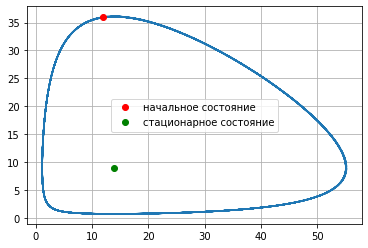
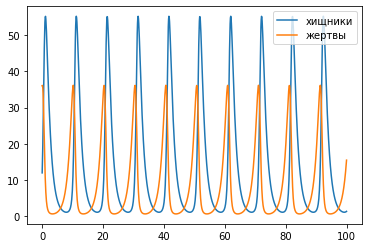

---
## Front matter
lang: ru-RU
title: Лабораторная работа №5
author: |
	Artur A. Davtyan\inst{1}
institute: |
	\inst{1}RUDN University, Moscow, Russian Federation
date: RUDN University, 13 March, 2021 Moscow, Russia

## Formatting
toc: false
slide_level: 2
theme: metropolis
header-includes: 
 - \metroset{progressbar=frametitle,sectionpage=progressbar,numbering=fraction}
 - '\makeatletter'
 - '\beamer@ignorenonframefalse'
 - '\makeatother'
aspectratio: 43
section-titles: true
---

# Прагматика выполнения лабораторной работы (Зачем)

## Прагматика выполнения лабораторной работы (Зачем)

- Эта модель помогает анализировать самые разные процессы, от биологических до экономических;

- В экономике, очевидно, действуют такие же принципы "хищник - жертва", иначе экономика бы никогда не развивалась;

- Модель Лотки-Вольтерры дала старт для описания моделей взаимодействия живых существ и процессов; 

- Модель хищник-жертва достаточно хорошо описывает процессы конкуренции, а конкурентов не обязательно должно быть только двое.

# Цель выполнения лабораторной работы

## Цель выполнения лабораторной работы

Рассмотреть простейшую модель "хищник-жертва" — модель Лотки-Вольтерры. 

# Задачи выполнения лабораторной работы

## Задачи выполнения лабораторной работы

1. Построить график зависимости численности хищников от численности жертв и графики изменения численности хищников и численности жертв при следующих начальных условиях: $x_{0}=12, y_{0}=36$.
2. Найти стационарное состояние системы.

# Результаты выполнения лабораторной работы

## Модель Лотки-Вольтерры

$$
\begin{cases}
    \frac{\partial x}{\partial t} = ax(t)+bx(t)y(t)
    \\
    \frac{\partial y}{\partial t} = -cy(t)-dx(t)y(t)
\end{cases}
$$

a — коэффициент естественной смертности хищников

b — коэффициент увеличения числа хищников

c — коэффициент естественного прироста жертв

d — коэффициент смертности жертв

## Стационарное состояние

Стационарное состояние системы будет в точке: 
$$x_0 = \frac{c}{d}, y_0 = \frac{a}{b}$$

## Графики

{ #fig:001 width=70% }

## Графики

{ #fig:002 width=70% }

## {.standout}

Рассмотрел простейшую модель "хищник-жертва" — модель Лотки-Вольтерры. 