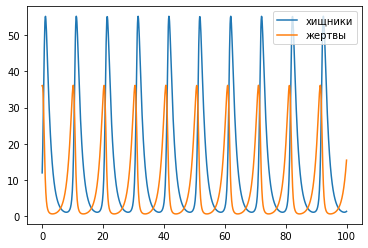

---
# Front matter
lang: ru-RU
title: "Лабораторная работа №4"
subtitle: "Модель гармонических колебаний"
author: "Давтян Артур Арменович"

# Formatting
toc-title: "Содержание"
toc: true # Table of contents
toc_depth: 2
lof: true # List of figures
lot: true # List of tables
fontsize: 12pt
linestretch: 1.5
papersize: a4paper
documentclass: scrreprt
polyglossia-lang: russian
polyglossia-otherlangs: english
mainfont: PT Serif
romanfont: PT Serif
sansfont: PT Sans
monofont: PT Mono
mainfontoptions: Ligatures=TeX
romanfontoptions: Ligatures=TeX
sansfontoptions: Ligatures=TeX,Scale=MatchLowercase
monofontoptions: Scale=MatchLowercase
indent: true
pdf-engine: lualatex
header-includes:
  - \linepenalty=10 # the penalty added to the badness of each line within a paragraph (no associated penalty node) Increasing the value makes tex try to have fewer lines in the paragraph.
  - \interlinepenalty=0 # value of the penalty (node) added after each line of a paragraph.
  - \hyphenpenalty=50 # the penalty for line breaking at an automatically inserted hyphen
  - \exhyphenpenalty=50 # the penalty for line breaking at an explicit hyphen
  - \binoppenalty=700 # the penalty for breaking a line at a binary operator
  - \relpenalty=500 # the penalty for breaking a line at a relation
  - \clubpenalty=150 # extra penalty for breaking after first line of a paragraph
  - \widowpenalty=150 # extra penalty for breaking before last line of a paragraph
  - \displaywidowpenalty=50 # extra penalty for breaking before last line before a display math
  - \brokenpenalty=100 # extra penalty for page breaking after a hyphenated line
  - \predisplaypenalty=10000 # penalty for breaking before a display
  - \postdisplaypenalty=0 # penalty for breaking after a display
  - \floatingpenalty = 20000 # penalty for splitting an insertion (can only be split footnote in standard LaTeX)
  - \raggedbottom # or \flushbottom
  - \usepackage{float} # keep figures where there are in the text
  - \floatplacement{figure}{H} # keep figures where there are in the text
---

# Цель работы

1. Построить график зависимости $x$ от $y$ и графики функций $x(t), y(t)$

2. Найти стационарное состояние системы

# Выполнение лабораторной работы

## Теоретическое введение

Простейшая модель взаимодействия двух видов типа «хищник-жертва» — модель Лотки-Вольтерры. Данная двувидовая модель основывается на следующих предположениях:
1. Численность популяции жертв x и хищников y зависят только от времени (модель не учитывает пространственное распределение популяции на занимаемой территории)
2. В отсутствии взаимодействия численность видов изменяется по модели Мальтуса (по экспоненциальному закону), при этом число жертв увеличивается, а число хищников падает
3. Естественная смертность жертвы и естественная рождаемость хищника считаются несущественными
4. Эффект насыщения численности обеих популяций не учитывается
5. Скорость роста численности жертв уменьшается пропорционально численности хищников

$$
\begin{cases}
    \frac{\partial x}{\partial t} = ax(t)+bx(t)y(t)
    \\
    \frac{\partial y}{\partial t} = -cy(t)-dx(t)y(t)
\end{cases}
$$

В этой модели $x$ – число жертв, $y$ - число хищников. Коэффициент $a$ описывает скорость естественного прироста числа жертв в отсутствие хищников, $с$ - естественное вымирание хищников, лишенных пищи в виде жертв. Вероятность взаимодействия жертвы и хищника считается пропорциональной как количеству жертв, так и числу самих хищников $(xy)$. Каждый акт взаимодействия уменьшает популяцию жертв, но способствует увеличению популяции хищников (члены $-bxy$ и $dxy$ в правой части уравнения). 

Математический анализ этой (жесткой) модели показывает, что имеется стационарное состояние (положение равновесия, не зависящее от времени решения). Если начальное состояние будет другим, то это приведет к периодическому колебанию численности как жертв, так и хищников, так что по прошествии некоторого времени система возвращается в начальное состояние.
Стационарное состояние системы будет в точке: $x_0 = \frac{c}{d}, y_0 = \frac{a}{b}$

Если начальные значения задать в стационарном состоянии $x(0)=x_0, y(0)=y_0$, то в любой момент времени численность популяций изменяться не будет. При малом отклонении от положения равновесия численности как хищника, так и жертвы с течением времени не возвращаются к равновесным значениям, а совершают периодические колебания вокруг стационарной точки. Амплитуда колебаний и их период определяется начальными значениями численностей $x(0), y(0)$. Колебания совершаются в
противофазе.

## Код на Python

```
import math
import numpy as np
from scipy.integrate import odeint
import matplotlib.pyplot as plt

a = 0.78 # коэффициент естественной смертности хищников
b = 0.81 # коэффициент естественного прироста жертв
c = 0.087 # коэффициент увеличения числа хищников
d = 0.058 # коэффициент смертности жертв

def syst2(x, t):
    dx0 = -a*x[0] + c*x[0]*x[1]
    dx1 = b*x[1] - d*x[0]*x[1]
    return dx0, dx1

x0 = [12, 36] # начальное значение x и у (популяция хищников и популяция жертв)

t = np.arange(0, 100, 0.1)

y = odeint(syst2, x0, t)

y2 = y[:,1] # массив хищников 
y1 = y[:,0] # массив жертв

plt.plot(t,y1, label='хищники')
plt.plot(t,y2, label='жертвы')
plt.legend()

plt.plot(y1,y2) #построение графика зависимости изменения численности хищников от изменения численности жертв
plt.plot(12,36, 'ro', label='начальное состояние')
plt.plot(b/d,a/c, 'go', label='стационарное состояние')
plt.legend()
plt.grid(axis='both')
```
## Графики

Зависимость изменения численности хищников от изменения численности жертв с начальными значениями $x_0=12, y_0=36$ и стационарное состояние (рис. -@fig:001)

{ #fig:001 width=70% }

Зависимость численности хщиников и жертв от времени с начальными данными у=12, х=36. (рис. -@fig:002)

{ #fig:002 width=70% }

# Выводы

1. Построил график зависимости $x$ от $y$ и графики функций $x(t), y(t)$

2. Нашёл стационарное состояние системы