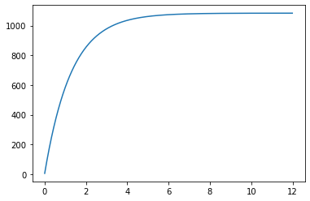
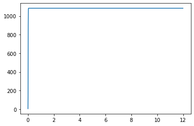
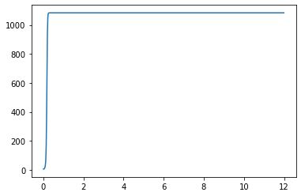
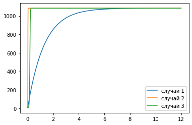
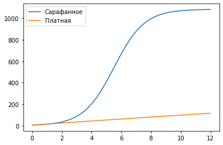

---
## Front matter
lang: ru-RU
title: Лабораторная работа №7
author: |
	Artur A. Davtyan\inst{1}
institute: |
	\inst{1}RUDN University, Moscow, Russian Federation
date: RUDN University, 22 March, 2021 Moscow, Russia

## Formatting
toc: false
slide_level: 2
theme: metropolis
header-includes: 
 - \metroset{progressbar=frametitle,sectionpage=progressbar,numbering=fraction}
 - '\makeatletter'
 - '\beamer@ignorenonframefalse'
 - '\makeatother'
aspectratio: 43
section-titles: true
---

# Прагматика выполнения лабораторной работы (Зачем)

## Прагматика выполнения лабораторной работы (Зачем)

- рекламодатели, рекламные агентства и каналы распространения рекламы давно и активно интересуются механизмами воздействия рекламы на потребителей;

- Это необходимо для того, чтобы:
	- сформулировать более эффективные рекламные стратегии;
	- показать результаты отдачи от рекламы; 
	- доказать соответствие выбора рекламных площадок для размещения.

# Цель выполнения лабораторной работы

## Цель выполнения лабораторной работы

Рассмотреть модель распространения рекламы.

# Задачи выполнения лабораторной работы

## Задачи выполнения лабораторной работы

1. Рассмотреть модель рапространения рекламы в разных случаях.

2. Построить график распространения рекламы о салоне красоты.

3. Сравнить решения, учитывающее вклад только платной рекламы и учитывающее вклад только сарафанного радио.

# Результаты выполнения лабораторной работы

## Модель распространения рекламы

Математическая модель распространения рекламы описывается уравнением:

$$ \frac{\partial n}{\partial t} = (\alpha_1(t) + \alpha_2(t)n(t))(N - n(t))$$

$\frac{\partial n}{\partial t}$ — скорость изменения со временем числа потребителей, узнавших о товаре и готовых его купить;

$t$ — время, прошедшее с начала рекламной кампании;

$n(t)$ — число уже информированных клиентов. 

$N$ — общее число потенциальных платежеспособных покупателей

$\alpha_1(t)>0$ — характеризует интенсивность рекламной кампании (зависит от затрат на рекламу в данный момент времени).

## Уравнения

- $\frac{\partial n}{\partial t} = (0.771 + 0.000007n(t))(N - n(t))$
- $\frac{\partial n}{\partial t} = (0.0000075 + 0.32n(t))(N - n(t))$
- $\frac{\partial n}{\partial t} = (0.52sin(t) + 0.32tn(t))(N - n(t))$

## Графики

$$ \alpha_1(t) > \alpha_2(t) $$

{ #fig:001 width=70% }

## Графики

$$ \alpha_1(t) < \alpha_2(t) $$

{ #fig:002 width=50% }

Наибольшая скорость достигается в момент времени 0.02.

## Графики

{ #fig:003 width=70% }

## Графики

{ #fig:004 width=70% }

## Графики

{ #fig:005 width=70% }

## {.standout}

Рассмотрел модель распространения рекламы в разных случаях и проанализировал отличия.