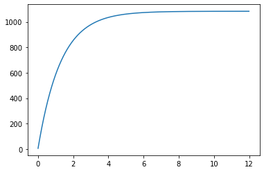
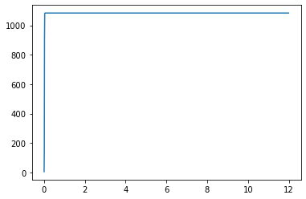

---
# Front matter
lang: ru-RU
title: "Лабораторная работа №7"
subtitle: "Эффективность рекламы"
author: "Давтян Артур Арменович"

# Formatting
toc-title: "Содержание"
toc: true # Table of contents
toc_depth: 2
lof: true # List of figures
lot: true # List of tables
fontsize: 12pt
linestretch: 1.5
papersize: a4paper
documentclass: scrreprt
polyglossia-lang: russian
polyglossia-otherlangs: english
mainfont: PT Serif
romanfont: PT Serif
sansfont: PT Sans
monofont: PT Mono
mainfontoptions: Ligatures=TeX
romanfontoptions: Ligatures=TeX
sansfontoptions: Ligatures=TeX,Scale=MatchLowercase
monofontoptions: Scale=MatchLowercase
indent: true
pdf-engine: lualatex
header-includes:
  - \linepenalty=10 # the penalty added to the badness of each line within a paragraph (no associated penalty node) Increasing the value makes tex try to have fewer lines in the paragraph.
  - \interlinepenalty=0 # value of the penalty (node) added after each line of a paragraph.
  - \hyphenpenalty=50 # the penalty for line breaking at an automatically inserted hyphen
  - \exhyphenpenalty=50 # the penalty for line breaking at an explicit hyphen
  - \binoppenalty=700 # the penalty for breaking a line at a binary operator
  - \relpenalty=500 # the penalty for breaking a line at a relation
  - \clubpenalty=150 # extra penalty for breaking after first line of a paragraph
  - \widowpenalty=150 # extra penalty for breaking before last line of a paragraph
  - \displaywidowpenalty=50 # extra penalty for breaking before last line before a display math
  - \brokenpenalty=100 # extra penalty for page breaking after a hyphenated line
  - \predisplaypenalty=10000 # penalty for breaking before a display
  - \postdisplaypenalty=0 # penalty for breaking after a display
  - \floatingpenalty = 20000 # penalty for splitting an insertion (can only be split footnote in standard LaTeX)
  - \raggedbottom # or \flushbottom
  - \usepackage{float} # keep figures where there are in the text
  - \floatplacement{figure}{H} # keep figures where there are in the text
---

# Цель работы

1. Рассмотреть модель эффективности рекламы в разных случаях.

2. Построить график распространения рекламы о салоне красоты.

3. Сравнить решения, учитывающее вклад только платной рекламы и учитывающее вклад только сарафанного радио.

# Выполнение лабораторной работы

## Теоретическое введение

Организуется рекламная кампания нового товара или услуги. Необходимо, чтобы прибыль будущих продаж с избытком покрывала издержки на рекламу. Вначале расходы могут превышать прибыль, поскольку лишь малая часть потенциальных покупателей будет информирована о новинке. Затем, при увеличении числа продаж, возрастает и прибыль, и, наконец, наступит момент, когда рынок насытится, и рекламировать товар станет бесполезным.

Предположим, что торговыми учреждениями реализуется некоторая продукция, о которой в момент времени $t$ из числа потенциальных покупателей $N$ знает лишь $n$ покупателей. Для ускорения сбыта продукции запускается реклама по радио, телевидению и других средств массовой информации. После запуска рекламной кампании информация о продукции начнет распространяться среди потенциальных покупателей путем общения друг с другом. Таким образом, после запуска рекламных объявлений скорость изменения числа знающих о продукции людей пропорциональна как числу знающих о товаре покупателей, так и числу покупателей о нем не знающих.

Модель рекламной кампании описывается следующими величинами. Считаем, что

$\frac{\partial n}{\partial t}$ — скорость изменения со временем числа потребителей, узнавших о товаре и готовых его купить;

$t$ — время, прошедшее с начала рекламной кампании;

$n(t)$ — число уже информированных клиентов. Эта величина пропорциональна числу покупателей, еще не знающих о нем. Это описывается следующим образом:

$$ \alpha_1(t)(N-n(t)) $$

$N$ — общее число потенциальных платежеспособных покупателей

$\alpha_1(t)>0$ — характеризует интенсивность рекламной кампании (зависит от затрат на рекламу в данный момент времени).

Помимо этого, узнавшие о товаре потребители также распространяют полученную информацию среди потенциальных покупателей, не знающих о нем (в этом случае работает т.н. сарафанное радио). Этот вклад в рекламу описывается величиной

$$ \alpha_2(t)n(t)(N-n(t)) $$

эта величина увеличивается с увеличением потребителей узнавших о товаре. 

Математическая модель распространения рекламы описывается уравнением:

$$ \frac{\partial n}{\partial t} = (\alpha_1(t) + \alpha_2(t)n(t))(N - n(t))$$

## Задание

Постройте график распространения рекламы, математическая модель которой описывается следующим уравнением:

- $\frac{\partial n}{\partial t} = (0.771 + 0.000007n(t))(N - n(t))$
- $\frac{\partial n}{\partial t} = (0.0000075 + 0.32n(t))(N - n(t))$
- $\frac{\partial n}{\partial t} = (0.52sin(t) + 0.32tn(t))(N - n(t))$

При этом объем аудитории $N$ = 1084, в начальный момент о товаре знает 5 человек.
Для случая 2 определите в какой момент времени скорость распространения рекламы будет иметь максимальное значение.

1. Построить график распространения рекламы о салоне красоты.
2. Сравнить эффективность рекламной кампании при $\alpha_1(t) > \alpha_2(t)$ и $\alpha_1(t) < \alpha_2(t)$
3. Определить в какой момент времени эффективность рекламы будет иметь максимально быстрый рост (на вашем примере).
4. Построить решение, если учитывать вклад только платной рекламы
5. Построить решение, если предположить, что информация о товаре распространятся только путем «сарафанного радио», сравнить оба решения

## Код на Python

```
import math
import numpy as np
from scipy.integrate import odeint
import matplotlib.pyplot as plt

x0 = 5 # количество людей, знающих о товаре в начальный момент времени

N = 1084 # максимальное количество людей,
# которых может заинтересовать товар

t = np.arange(0, 12, 0.01) # временной промежуток
# (длительность рекламной компании)

# функция, отвечающая за платную рекламу, альфа1

def k1(t):
    g = 0.771
    return g

def k2(t):
    g = 0.0000075
    return g

def k3(t):
    g = 0.52*np.sin(t)
    return g

# для задания из лабораторной

def k4(t):
    g = 0.009
    return g

# функция, описывающая сарафанное радио, альфа2

def p1(t):
    v = 0.000007
    return v

def p2(t):
    v = 0.32
    return v

def p3(t):
    v = 0.32*t
    return v

# для задания из лабораторной

def p4(t):
    v = 0.0009
    return v

# уравнение, описывающее распространение рекламы

# из задания

def f1(x, t):
    xd1 = ( k1(t) + p1(t)*x )*( N - x )
    return xd1

def f2(x, t):
    xd2 = ( k2(t) + p2(t)*x )*( N - x )
    return xd2


def f3(x, t):
    xd3 = ( k3(t) + p3(t)*x )*( N - x )
    return xd3

# платная реклама равна нулю

def f4(x, t):
    xd4 = ( p4(t)*x )*( N - x )
    return xd4

# сарафанное радио равно нулю

def f5(x, t):
    xd5 = k4(t) *( N - x )
    return xd5

# решение ОДУ
x1 = odeint(f1, x0, t)
x2 = odeint(f2, x0, t)
x3 = odeint(f3, x0, t)
x4 = odeint(f4, x0, t)
x5 = odeint(f5, x0, t)

plt.plot(t, x1) # случай 1

plt.plot(t, x2) # случай 2

# Момент времени с максимальной скоростью
t[np.argmax(x2[1:].reshape(1,1199)/t[1:]) + 1]

plt.plot(t, x3) # случай 3

plt.plot(t, x1, label='случай 1') # случай 1
plt.plot(t, x2, label='случай 2') # случай 2
plt.plot(t, x3, label='случай 3') # случай 3
plt.legend()

plt.plot(t, x4, label='Сарафанное') # нет платной
plt.plot(t, x5, label='Платная') # нет сарафанного
plt.legend()
```

## Графики
Первый случай: $\alpha_1(t) = 0.771$, $\alpha_2(t) = 0.000007$.

$\alpha_1(t) > \alpha_2(t)$. (рис. -@fig:001)

{ #fig:001 width=70% }

Второй случай: $\alpha_1(t) = 0.0000075$, $\alpha_2(t) = 0.32$. Наибольшая скорость достигается в момент времени 0.02.

$\alpha_1(t) < \alpha_2(t)$. (рис. -@fig:002)

{ #fig:002 width=70% }

Третий случай: $\alpha_1(t) = 0.52*np.sin(t)$, $\alpha_2(t) = 0.32t$. (рис. -@fig:003)

{ #fig:003 width=70% }

Все случаи вместе (рис. -@fig:004):

{ #fig:004 width=70% }

Для сравнения эффективности сарафанного радио и платной рекламы, предположим, что $\alpha_1( ) = \alpha_2(t) = 0.0009$. (рис. -@fig:005)

{ #fig:005 width=70% }

## Вопросы к лабораторной

### Записать модель Мальтуса (дать пояснение, где используется данная модель)

$$ \frac{\partial N}{\partial t} = rN $$

где

- $N$ — исходная численность населения,
- $r$ — коэффициент пропорциональности, для которого $r = b - d$, где
    - $b$ — коэффициент рождаемости
    - $d$ — коэффициент смертности
- t — время.

Модель используется в экологии для расчета изменения популяции особей животных.

### Записать уравнение логистической кривой (дать пояснение, что описывает данное уравнение)

$$ \frac{\partial P}{\partial t} = rP(1 - \frac{P}{K}) $$

- $r$ — характеризует скорость роста (размножения)
- $K$ — поддерживающая ёмкость среды (то есть, максимально возможная численность популяции)

Исходные предположения для вывода уравнения при рассмотрении популяционной динамики выглядят следующим образом:

- скорость размножения популяции пропорциональна её текущей численности, при прочих равных условиях;
- скорость размножения популяции пропорциональна количеству доступных ресурсов, при прочих равных условиях. Таким образом, второй член уравнения отражает конкуренцию за ресурсы, которая ограничивает рост популяции.

### На что влияет коэффициент $\alpha_1(t)$ и $\alpha_2(t)$ в модели распространения рекламы

$\alpha_1(t)$ — интенсивность рекламной кампании, зависящая от затрат

$\alpha_2(t)$ — интенсивность рекламной кампании, зависящая от сарафанного радио

### Как ведет себя рассматриваемая модель при $\alpha_1(t) \gg \alpha_2(t)$

При $\alpha_1(t) \gg \alpha_2(t)$ получается модель типа модели Мальтуса (рис. -@fig:006):

{ #fig:006 width=70% }

### Как ведет себя рассматриваемая модель при $\alpha_1(t) \ll \alpha_2(t)$

При $\alpha_1(t) \ll \alpha_2(t)$ получаем уравнение логистической кривой (рис. -@fig:007):

{ #fig:007 width=70% }


# Выводы

1. Рассмотрел модель эффективности рекламы в разных случаях.

2. Построил график распространения рекламы о салоне красоты.

3. Сравнил решения, учитывающее вклад только платной рекламы и учитывающее вклад только сарафанного радио.